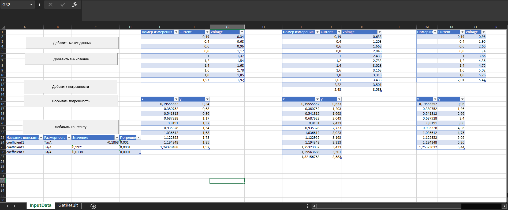

# VBA макрос: умная обработка физического эксперимента
<h1 align="left">
    
</h1>

## Содержание
- [Аннотация](#аннотация)
- [Описание функционала](#описание-функционала)
- [Как начать работать](#как-начать-работать)
- [Работа с приложением](#работа-с-приложением)
- [Подсчёт погрешности величины](#подсчёт-погрешности-величины)

---

## Аннотация
Проект представлет собой приложение написанное на языке макросов VBA, которое позволяет быстрее осуществлять обработку больших массивов данных. Приложение автоматизирует подсчёт самых основных статистических результатов для большой серии однотипных данных, такие как: коэфициенты линейной регресси и их погрешности, среднеквадратичное отклонение, среднее значение. Реализована возможность прописывать формулы для обработки исходных данных, через имена переменных. Также реализована возможность подсчёта суммарной погрешности для величин, заданных как произведение физических величин в произвольной степени, либо как их сумма.
## Описание функционала
Проект состоит из 3 основных частей
## Как установить
Для установки следует скопировать шаблон ****.xlms, в формате, поддерживающем макросы Excel.
[Скачать шаблон](https://vk.com/id527618351)
## Работа с приложением
Рассмотрим осовные этапы работы с приложением. В качестве примера возьмём физический эксперимент, где для 3-х серий экспермиента требуется посчитать

### Внесение данных
После того, как шаблон был скачан и открыт, вы увидите меню работы с приложением
<h1 align="left">
    
</h1>
Чтобы добавит макет данных, надо нажать на соответсвующую кнопку. После этого надо будет внести соответствующие
данные о количестве экспериментов и количестве измеренных переменных

<h1 align="left">
    
</h1>
Далее вносим названия перменных, которые в дальнейшем будут использоваться при вводе формул
<h1 align="left">
    
</h1>
В итоге будет создано количество таблиц соответствующее количеству экспериментов.
После этого внесём данные в каждую таблицу.
<h1 align="left">
    
</h1>

Добавим некоторые константы, которые потребуются в дальнейших формулах. Для этого
нажмём на соответствующие формулы.
<h1 align="left">
    
</h1>

Теперь посчитаем коэфициенты линейно регрессии для каждого эксперимента. Нажмём на кнопку "Добавить вычисление" и выбрав в выпадающем списки требуемый пункт.

<h1 align="left">
    
</h1>

Введем необходимые формулы.

Замечание: удобство приложения заключается в том, что кажой переменне и константе присвоено имя, который пользователь ввёл при занесеннии данных,
поэтому в формулах обращения происходят не по номерам ячеек, а по названиям переменных.
<h1 align="left">
    
</h1>

В итоге будут созданы вспомоагтельные таблицы для каждого эксперимента со столбцами "x" и "y". По ним и вычисляются необходимые параметры регрессии.
Все результаты неходятся на листе "GetResults"
<h1 align="left">
    
</h1>

## Подсчёт погрешности величины
Если требуется посчитать погрешность некоторой величны, которая представляет собой либо сумму различных физических величин, либо
их произведения в в произвольных степенях, то приложение позволяет облегчить расчёт абсолютной погрешности.

Нажмём на кнопку "Добавить погрешности" в меню приложения. Выберем тип погрешности.
<h1 align="left">
    
</h1>

Создаться таблица, которую нужно заполнить необходимыми данными. После заполнения следует нажать на кнопку "Посчитать погрешность".
<h1 align="left">
    
</h1>

Погрешность величины посчитается и результат добавиться в общую таблицу результатов на листе "GetResults"
<h1 align="left">
    
</h1>