# VBA макрос: Умная обработка физического эксперимента

<h1 align="left">
    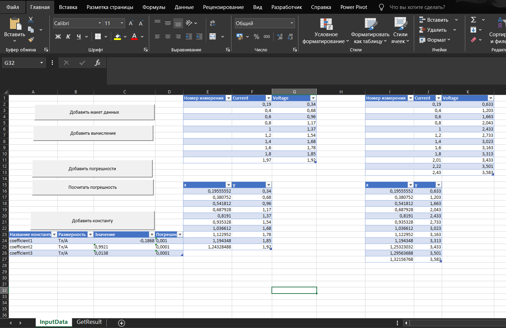
</h1>

## Содержание
- [Аннотация](#аннотация)
- [Описание функционала](#описание-функционала)
- [Как начать работать](#как-начать-работать)
- [Работа с приложением](#работа-с-приложением)
- [Подсчёт погрешности величины](#подсчёт-погрешности-величины)

---

## Аннотация

Проект представляет собой приложение, написанное на языке макросов VBA, предназначенное для эффективной обработки больших массивов данных в контексте физического эксперимента. Оно автоматизирует вычисление ключевых статистических показателей, таких как коэффициенты линейной регрессии и их погрешности, среднеквадратичное отклонение и среднее значение. 

Кроме того, приложение позволяет вводить формулы для обработки исходных данных, используя переменные с заданными именами. Реализована возможность расчёта суммарной погрешности для величин, заданных как произведение физических величин в произвольных степенях или их суммы.

## Описание функционала

Проект состоит из трёх основных частей:

1. **Обработка данных** — автоматизированное вычисление статистических показателей для экспериментальных данных.
2. **Построение регрессионных моделей** — вычисление коэффициентов линейной регрессии и их погрешностей.
3. **Подсчёт погрешностей** — расчёт погрешностей для сложных величин, выраженных через суммы или произведения физических величин.

## Как установить

Для установки скачайте шаблон в формате Excel с макросами **.xlsm**:

- [Скачать шаблон](https://vk.com/id527618351)

После скачивания откройте файл в Excel с включёнными макросами.

## Работа с приложением

Рассмотрим основные этапы работы с приложением на примере физического эксперимента, где для трёх серий эксперимента требуется посчитать ключевые статистические параметры.

### Внесение данных

После того, как шаблон был скачан и открыт, вы увидите главное меню приложения:

<h1 align="left">
    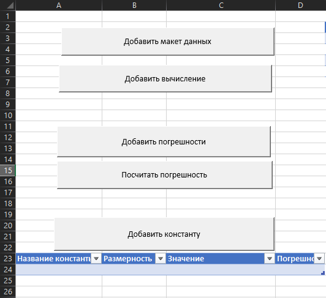
</h1>

Чтобы добавить макет данных, нажмите соответствующую кнопку. Затем введите информацию о количестве экспериментов и количестве измеренных переменных.

<h1 align="left">
    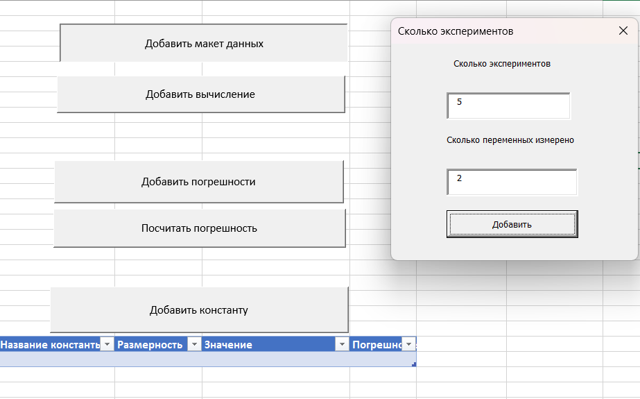
</h1>

Далее введите названия переменных, которые будут использоваться в формулах.

<h1 align="left">
    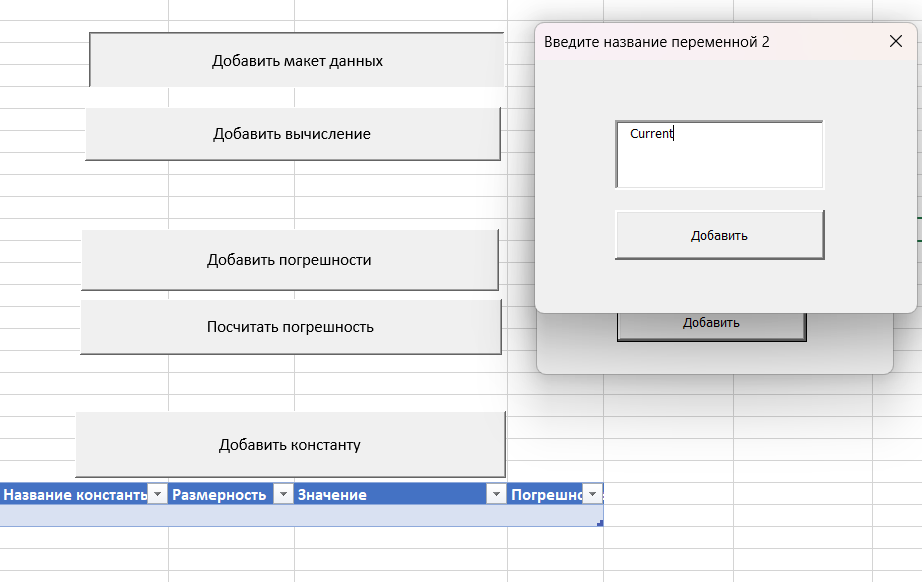
</h1>

На этом этапе будет создано необходимое количество таблиц в соответствии с количеством экспериментов. Затем можно ввести данные для каждого эксперимента.

<h1 align="left">
    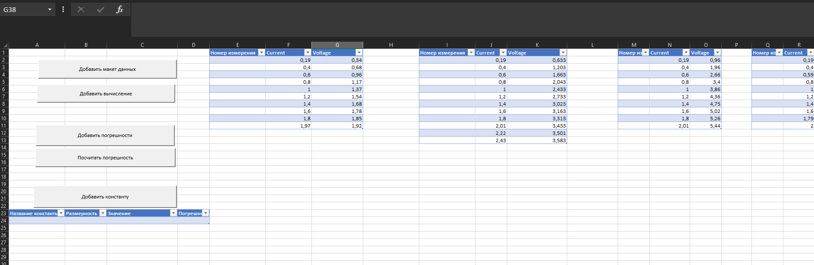
</h1>

Добавьте константы, которые потребуются для дальнейших вычислений, нажав на соответствующую кнопку.

<h1 align="left">
    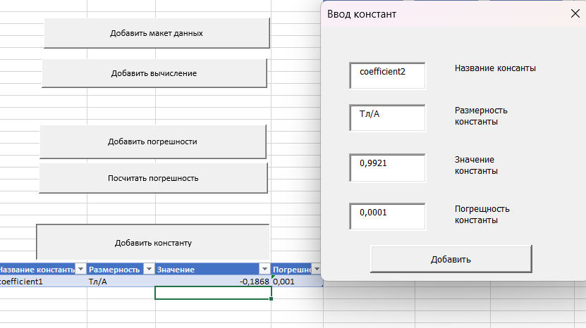
</h1>

### Вычисление коэффициентов линейной регрессии

Теперь можно вычислить коэффициенты линейной регрессии для каждого эксперимента. Для этого нажмите на кнопку "Добавить вычисление" и выберите необходимую опцию из выпадающего списка.

<h1 align="left">
    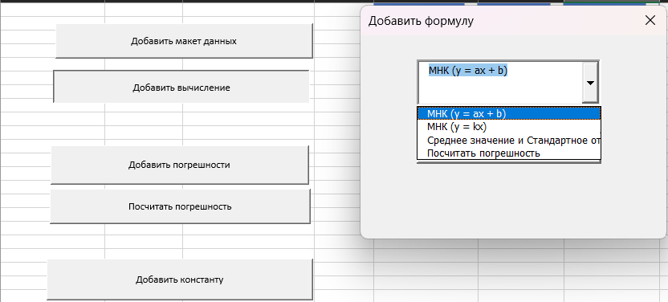
</h1>

Введите соответствующие формулы для расчёта.

**Замечание**: удобство приложения заключается в том, что каждой переменной и константе присваивается имя, которое пользователь указал при внесении данных. Поэтому в формулах обращения происходят не по номерам ячеек, а по именам переменных, что значительно упрощает процесс ввода.

<h1 align="left">
    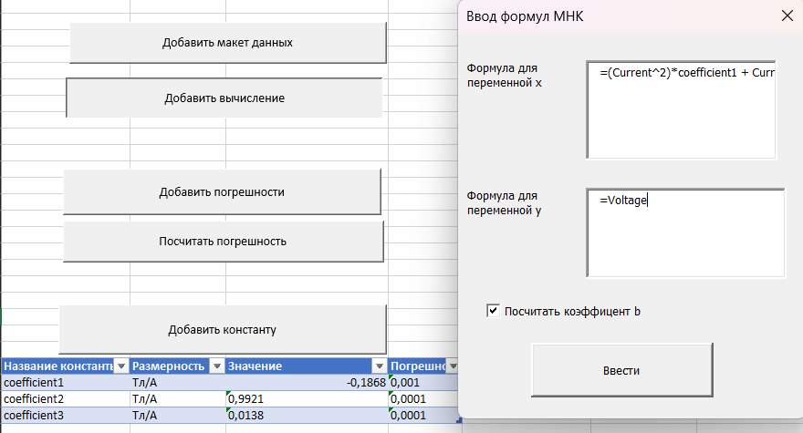
</h1>

После ввода формул будут автоматически созданы вспомогательные таблицы для каждого эксперимента с столбцами "x" и "y", на основе которых и рассчитываются коэффициенты линейной регрессии. Все результаты можно найти на листе **"GetResults"**.

<h1 align="left">
    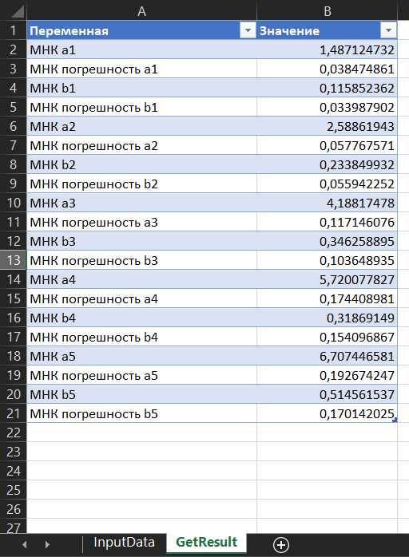
</h1>

## Подсчёт погрешности величины

Если необходимо вычислить погрешность физической величины, которая представляет собой либо сумму различных величин, либо их произведение в произвольных степенях, приложение позволяет легко рассчитать её абсолютную погрешность.

Для этого нажмите кнопку **"Добавить погрешности"** в меню приложения и выберите тип погрешности.

<h1 align="left">
    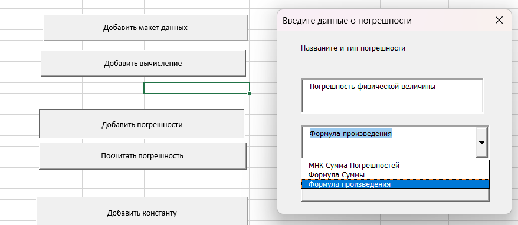
</h1>

Будет создана таблица, которую необходимо заполнить соответствующими данными. После заполнения нажмите кнопку **"Посчитать погрешность"**.

<h1 align="left">
    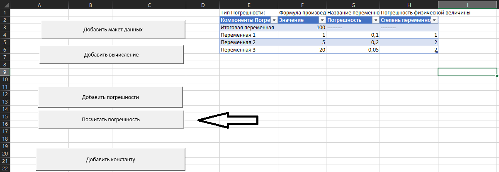
</h1>

Погрешность будет рассчитана, и результат будет добавлен в общую таблицу результатов на листе **"GetResults"**.

<h1 align="left">
    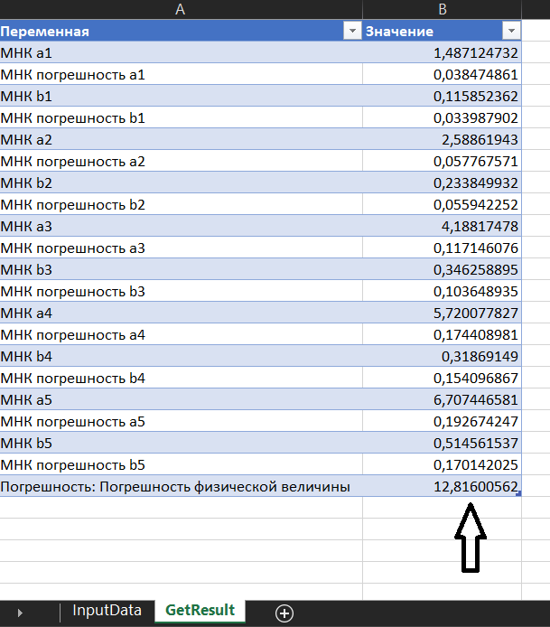
</h1>
